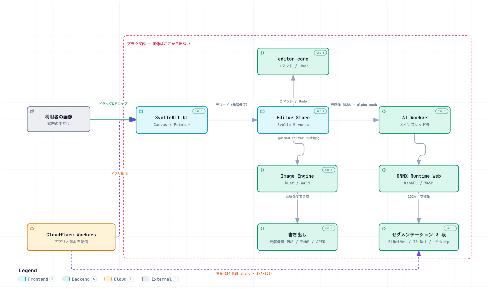

# Kirily（きりり）

> 画像を、きりり。

ブラウザだけで背景透過・マスク編集・トリミング・書き出しを行う Web サービス。
**元画像の解像度を保ったまま書き出す**こと、**画像をサーバーへ送らない**ことが
この製品の中身です。



> 対話版（探索・トレース・エクスポートができます）:
> [`docs/diagrams/kirily-architecture.html`](docs/diagrams/kirily-architecture.html)

## はじめかた

```bash
mise install
bun install          # svelte-kit sync まで走ります
bunx lefthook install
bun run wasm:build   # Rust → packages/wasm/pkg（git 管理外）
bun run models:fetch # AI モデルを取得（約 198 MiB、git 管理外）
bun run dev          # http://localhost:5173
```

モデルが無くても起動します。その場合、背景透過は簡易処理に落ちます。

## コマンド

```bash
bun run check        # fmt + lint + typecheck + test + cargo fmt/clippy/test
bun run test         # TypeScript の単体テスト
cargo test --workspace
bun run e2e          # Playwright（desktop + mobile）。初回は bun run e2e:install
bun run e2e:webgpu   # WebGPU 段の E2E。実 GPU が要ります
bun run build        # wasm → SvelteKit（Cloudflare 向け）
bun audit            # 依存の既知の脆弱性
```

## 技術スタック

|          |                                                        |
| -------- | ------------------------------------------------------ |
| UI       | SvelteKit + Svelte 5（runes）+ TypeScript strict       |
| スタイル | Tailwind CSS v4（`@theme` トークン、ライト / ダーク）  |
| 画像処理 | Rust → WebAssembly、TypeScript フォールバック付き      |
| AI       | ONNX Runtime Web（WebGPU / WASM）を Web Worker で      |
| 配信     | Cloudflare Workers / Pages                             |
| ビルド   | Bun workspaces（pnpm / Turborepo ではない — ADR-0005） |
| 品質     | oxlint + oxfmt + lefthook + mise                       |

## 背景透過のモデル

端末の能力に応じて 3 段から選びます（[ADR-0007](docs/adr/0007-segmentation-model.md)）。

| 段  | モデル                    | ライセンス | 入力  | サイズ  | 条件                             |
| --- | ------------------------- | ---------- | ----- | ------- | -------------------------------- |
| 1   | BiRefNet-lite (fp16)      | MIT        | 1024² | 109 MiB | WebGPU（storage buffer 11 以上） |
| 2   | IS-Net general-use (fp16) | MIT        | 1024² | 84 MiB  | WebGPU                           |
| 3   | U²-Netp                   | Apache-2.0 | 320²  | 4.4 MiB | 常時（WASM）                     |

**提示する前に端末の能力を見ます。** BiRefNet は Apple GPU では動かず
（デコーダの `Split` が storage buffer を 11 個要求し、上限は 10）、
落ちるのは 109 MiB をダウンロードし終えたあとだからです。

重みは git 管理外で、`bun run models:fetch` がサイズと SHA-256 を検証してから
24 MiB 未満の shard に分割し、**自分のドメインから**配信します
（Cloudflare の 1 ファイル 25 MiB 上限のため）。ブラウザ側は結合後に
再度ハッシュを検証します。ページは外部ドメインへ一切接続しません
（`connect-src 'self'`）。

推論後、元画像をガイドにした guided filter でマスクの輪郭を実エッジへ寄せます
（[ADR-0008](docs/adr/0008-mask-refinement.md)）。

## 構成

```text
kirily/
├── apps/web/                SvelteKit。Canvas / File / Pointer はここだけ
│   └── src/lib/
│       ├── editor/          デコード・AI の手順・書き出し
│       ├── workers/         AI Worker
│       └── components/      画面
├── packages/
│   ├── contract/            型・Result・エラー・座標系（依存ゼロ）
│   ├── image-core/          純粋なピクセル処理（DOM なし）
│   ├── editor-core/         編集状態・コマンド・Undo/Redo（DOM なし）
│   ├── ai/                  背景除去プロバイダ、モデル選択、ONNX 連携
│   └── wasm/                WASM のロードとフォールバック
├── crates/
│   ├── kirily-image/        画像バッファの基本型
│   ├── kirily-mask/         マスク操作（ブラシ・feather・合成）
│   ├── kirily-raster/       ピクセル処理（合成・crop・guided filter）
│   └── kirily-wasm/         JS との境界（wasm-bindgen はここだけ）
├── tests/
│   ├── e2e/                 Playwright
│   └── fixtures/            テスト画像（用途は fixtures/README.md）
├── tools/                   モデル取得・アセット検査・lint プラグイン
├── docs/                    設計書・アーキテクチャ・ADR・構成図
└── .agents/skills/          エージェント向けの規約（.claude/skills から symlink）
```

## 設計の要点

1. **元画像を壊さない。** 編集は状態として持ち、最後に合成する。
2. **Preview と Export は別のパイプライン。** 書き出しは常に元解像度から。
3. **AI の結果はマスクとして持つ。** 手動編集を上書きしない（base / keep / remove）。
4. **重い処理は Rust/WASM と Worker へ。** ただし TypeScript 実装も必ず残す。
5. **端末が動かせないものを提示しない。** 失敗は 100 MiB 以上ダウンロードした後に起きる。
6. **サーバーへ画像を送らなくても基本機能が動く。**

詳しくは [docs/architecture.md](docs/architecture.md) と [docs/adr/](docs/adr/)。

## 書く場所ごとに答える問いを変える

| 書く場所       | 答える問い  |
| -------------- | ----------- |
| コード         | **How**     |
| テストコード   | **What**    |
| コミットログ   | **Why**     |
| コードコメント | **Why not** |

同じことを 2 か所に書きません。詳細は `.agents/skills/kirily-typescript/`。

## 依存の扱い

サプライチェーンは実際に攻撃されている経路です（[ADR-0009](docs/adr/0009-supply-chain.md)）。

- 依存は正確なバージョンで固定（`exact = true`）
- 公開から 7 日待つ（`minimumReleaseAge`）
- 依存の `postinstall` は実行しない（`bun pm untrusted` で確認できます）
- GitHub Actions は commit SHA で固定。CI が検査します
- `bun audit --audit-level=high` を通らないものはマージしません
- 更新は止めません。Dependabot が weekly で上げてきます

## 現状

垂直スライス（アップロード → 自動透過 → ブラシ補正 → Undo → 元解像度 PNG 書き出し）が
PC とモバイルの両方で通ります。

手動補正はブラシ（残す / 消す）とバケツ（クリックで領域をまとめて）。
ズーム / パンで細部に寄れ、トリミングは比率プリセット（1:1・4:3・16:9 ほか）付き。
バケツの許容差は RGB ではなく **OKLab** で測ります — 背景と肌が RGB で
9.4 しか離れていない画像でも、被写体を飲まずに背景だけを取れます。

輪郭は**モデルのマスクではなく画像の画素から**決めます。合成の式
`I = αF + (1−α)B` を解いて α を求めるので、320² のモデルしか動かない端末でも
1024² の段と同じ輪郭が出ます（細い房の Boundary F 0.961 → 0.992 対 0.990、
[ADR-0013](docs/adr/0013-colour-matting.md)）。F と B が同じ色のとき —
白いシャツと白い背景 — は式に割るものが無いので、そこだけモデルに任せます。

速度は段ごとに測っています（`?timings=1`、[ADR-0015](docs/adr/0015-performance-instrumentation.md)）。
最初の測定で、ロードマップが挙げていたタイル処理と SIMD には効く先が無く
（decode 3〜8ms、export 43ms）、本当のボトルネックは**レンダラ**だと分かりました
— Retina 全画面で 84.6ms/フレーム、12fps です。

合成は **WebGL2 のフラグメントシェーダ**で行います。1 フレームのメインスレッド
コストが 55.78ms から 0.02ms になり、ブラシで塗っている最中も入力を受けられます
（[ADR-0016](docs/adr/0016-webgl-renderer.md)）。WebGL2 が無い環境では
Canvas 2D に落ちます。**両方が同じ絵を描くこと**は E2E が全画素で検証しています
（最大差 2/255）。

テスト: TypeScript 296 / Rust 27 / E2E 52（PC + モバイル、+ WebGPU 段）。

切り抜き品質は点検査ではなく**数値**で押さえています。正解のアルファが
算術的に分かる合成画像 5 枚に対し、IoU / Boundary F-score / MAE を測って
`tests/e2e/baselines.json` と突き合わせ、0.02 より下がったら落とします
（[ADR-0010](docs/adr/0010-quality-evaluation.md)）。最初の測定で、
高精度段が効いているのは面ではなく**輪郭**だと分かりました
（細い房の Boundary F 0.961 → 0.993）。

ソフトエッジからは**元の背景色を抜きます**。市松模様の上では見えず、
別の背景に置いた瞬間に出るのが色かぶりなので、背景を 32px 角のグリッドで
推定して混色を解きます（[ADR-0011](docs/adr/0011-decontamination.md)）。
soft 画素の色誤差が細い房で 0.382 → 0.135 に下がり、
アルファ側の 3 指標は小数第 3 位まで動いていません。

進捗と残りは [docs/roadmap.md](docs/roadmap.md)。

## ライセンス

MIT（予定）。同梱するモデルの重みは git 管理外で、
それぞれの配布元のライセンスに従います（MIT / Apache-2.0）。
